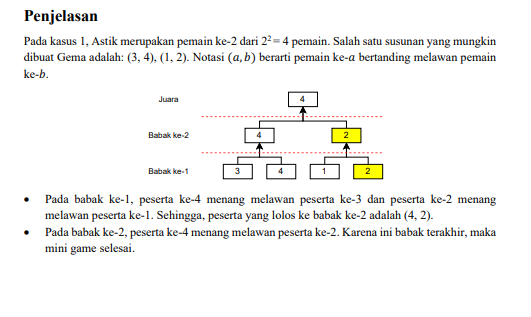
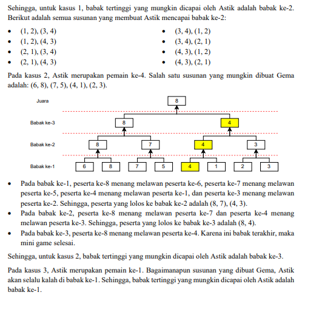

# STUDY CASE

## 1. Pak Dengklek dan BU Dengklek
>  OSN INFORMATIKA 2025

Pak Dengklek dan Bu Dengklek memiliki 
N ekor bebek yang sedang berbaris dalam satu baris dari kiri ke kanan. Pada awalnya, Pak Dengklek berada pada ujung kiri barisan sedangkan Bu Dengklek berada pada ujung kanan barisan.

Pak Dengklek akan bergerak ke kanan barisan sambil mencatat tinggi bebek secara berturut-turut. Pak Dengklek mengamati bahwa bebek ke-i  memiliki ketinggian 
Ai. Apabila Bu Dengklek bergerak ke kiri barisan sambil mencatat tinggi bebek secara berturut-turut, maka bagaimanakah pengamatan Bu Dengklek terhadap ketinggian bebek-bebeknya?

Masukan:
```
N
A1
A2
...
An
```

Keluaran: 
Keluarkan N baris yang berisi pengamatan Bu Dengklek terhadap ketinggian bebek-bebeknya; yakni tinggi bebek dari kanan ke kiri secara berturut-turut.

Contoh input:
```
5
100
200
75
100
325
```

contoh keluaran
```
325
100
75
200
100
```

## 2. Nihillation
> ICPC JAKARTA 2025

You are given an array A = [A1, A2, . . . , AN ] consisting of N positive integers.
In one operation, you can choose integers m and k such that 1 ≤ k < m ≤ 10^9 and set Ai := (Ai×k) mod m
for 1 ≤ i ≤ N.
What is the minimum number of operations needed to make all Ai equal to 0? Output any sequence of
operations to be done. It can be proven that it is always possible to make all Ai equal to 0.

Input
Input begins with an integer N (1 ≤ N ≤ 100 000). The next line contains N integers Ai (1 ≤ Ai ≤ 10^9
)
representing the given array A.

Output
In the first line, output the minimum number q of operations needed.
In the next q lines, output two integers m and k, representing the operation in the sequence of

Sample input 
```
5
4 1 2 6 3
```

Sample Output:
```
2
12 6
3 2
```

## 3. Maximeter
> ICPC JAKARTA 2025

Solve the problem below for T test cases.
You are given two integers M and D. You are interested in a rooted weighted tree with the following conditions.
• Each edge has a weight of a positive integer.
• For each vertex v of the tree, there exists no set of v’s children of size strictly greater than M such
that all the edges connecting v and this set of children all have the same weight.
• The diameter of the tree is not greater than D. The diameter of a tree is the maximum distance between
any two vertices.
Find the maximum number of vertices of such a tree. As the number of vertices can be very large, find the
vertex count modulo 998 244 353.

Input
The first line contains an integer T (1 ≤ T ≤ 100), the number of test cases. Each of the next T lines contains two integers M and D (1 ≤ M, D ≤ 10^9 ) representing a case you have to solve.

Output
For each of the T test cases, output a single line containing the maximum number of vertices modulo 998 244 353

Sample input 
```
3
2 4
165 1
20 20
```

Sample output
```
12
2
891869870
```

## 4. Pasangan Malang
> OSN INFORMATIKA 2025

Pak Dengklek memiliki sebarisan bilangan bulat (A1 A2, ..., An) sepanjang N.

Sepasang bilangan bulat(i,j) dikatakan pasangan malang apabila memenuhi  1 < i < j<=N dan KPK(Ai,Aj) < XOR (Ai, Aj).

Pak Dengklek ingin tahu ada berap abanyak pasangan malang yang ada.

Catatan:
KPK dari dua buah bilangan bulat positif didefinisikan sebagai bilangan bulat positif terkecil yang habis dibagi dua bilangan tersebut. Sebagai contoh, KPK dari 4 dan 6 adalah 12 karena 12 habis dibagi 4 maupun 6 dan tidak ada bilangan positif lebih kecil yang dapat membagi keduanya.

Bitwise XOR dari dua buah bilangan bulat x dan y dapat dihitung dengan cara sebagai berikut.

1. Tulis x dan y dalam basis dua dengan panjang bit yang sama.
2. Lakukan operasi XOR untuk setiap pasang bit yang bersesuaian dengan:
0 XOR 0 = 0
0 XOR 1 = 1
1 XOR 0 = 1
1 XOR 1 = 0
3. Ubah hasil XOR
XOR yang didapatkan kembali ke basis sepuluh.

Sebagai contoh, 
6 XOR 10 = 12. karena 6 = 0110 dan 10 = 1010 dalam basis dua, sehingga didapatkan bitwise XOR-nya dalah 1100 = 12 dalam basis 10.

sample input 
```
N
A1 A2 ... An
```

```
4
3 12 12 4
```

sample output
```
sebuah bilangan bulat yang menyatakan banyaknya pasangan malang
```

```
2
```

penjelasan:
pasangan yang malang adalah (1,2) dan (1,3). ini karena KPK(3,12) = 12, dan XOR (3,12) = 15.

## 5. Astik Berkompetisi
> PENYISIHAN GEMASTIK 2025

Dalam pelaksanaan Gemastik 2025, terdapat sebuah mini game yang diikuti oleh 2^N peserta, yang
diselenggarakan dalam format turnamen knock-out. Aturan dalam format knock-out adalah sebagai
berikut: peserta yang kalah dalam setiap pertandingan langsung dieliminasi dan tidak dapat
melanjutkan ke babak berikutnya. Pada mini game ini, peserta akan bertanding dalam beberapa
babak hingga mencapai babak final. Babak pertama diikuti oleh 2^N peserta, dan pemenang dari
setiap pertandingan akan melaju ke babak berikutnya. Di setiap babak, jumlah peserta berkurang
setengahnya, sehingga pada babak kedua akan tersisa 2^(N-1) peserta, dan seterusnya hingga
mencapai babak terakhir, yaitu babak final yang hanya diikuti oleh dua peserta. Setiap peserta
dalam mini game ini memiliki kekuatan yang berbeda. Tepatnya, peserta ke-𝑖 memiliki kekuatan
sebesar 𝑖. Setiap kali dua peserta bertanding, pemenangnya adalah peserta dengan kekuatan yang
lebih tinggi.
Pada mulanya, akan dibuat sebuah urutan berupa permutasi dari 1 sampai 2^N yang menyatakan
urutan pertandingan babak pertama. Dua peserta urutan pertama akan bertanding, kemudian dua
peserta berikutnya, dan seterusnya. Semua peserta yang kalah akan dikeluarkan dari urutan.
Pertandingan pada babak kedua akan dijalankan dengan cara yang serupa tanpa mengubah urutan
relatif dari peserta yang menang, dan seterusnya.
Salah satu panitia dalam mini game ini, yaitu Gema, bertanggung jawab untuk mengatur jalannya
pertandingan pada mini game tersebut. Ketika Gema melihat daftar peserta, ia menyadari bahwa
Astik merupakan peserta ke-𝐾 dalam mini game tersebut. Karena Gema dan Astik berteman baik,
Gema ingin membantu Astik agar dapat melaju sejauh mungkin dalam mini game ini. Oleh karena
itu, Gema berencana untuk mengatur pertandingan pada babak pertama sedemikian rupa agar Astik
mencapai babak setinggi mungkin.
Tugas Anda adalah untuk menentukan babak tertinggi yang mungkin dicapai oleh Astik, dengan
bantuan Gema yang dapat mengatur pembagian pertandingan pada babak pertama.

Masukan terdiri atas beberapa baris. Baris pertama berisi satu buah bilangan bulat positif 𝑇 (1 ≤
𝑇 ≤ 10^5) yang merupakan banyak kasus. 𝑇 baris berikutnya masing-masing berisi atas dua
bilangan bulat positif 𝑁 dan 𝐾 (1 ≤ 𝑁 ≤ 20, 1 ≤ 𝐾 ≤ 2^N).
Untuk soal A1, keluaran terdiri atas 𝑇 baris dengan setiap baris berisi satu buah bilangan bulat
yang merupakan babak tertinggi yang mungkin dicapai oleh Astik.

Sample input 
```
3
2 2
3 4
6 1
```

sample output
```
2
3
1
```

penjelasan:

